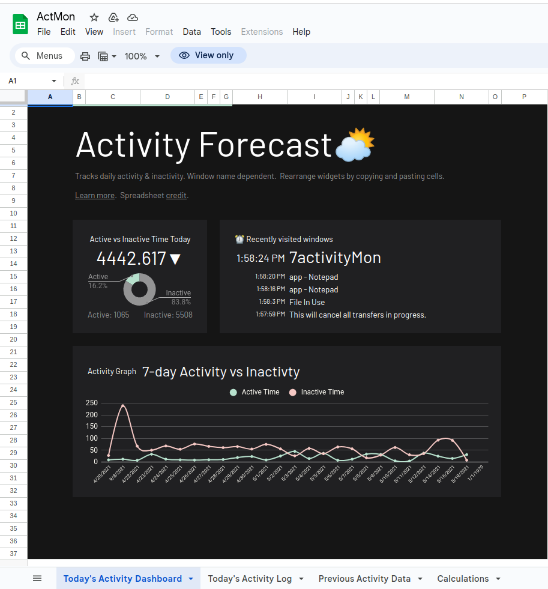

# Changelog

## 2023-07-30

- New DB structure
    - Store timestamps as integers 
    - Use `actStart` integer timestamp as primary key index 
    - `actStart` and `actEnd`, `inactDuration` are now stored as integer milliseconds
    - Rename columns `actStart`, `actEnd`, `inactDuration` to `startMS`, `endMS`, `idleMS`
    - A new column `lengthMS`
    - `startMS` and `endMS` is still served as 

- Activity tracking library
    - I published the activity tracker code as a Python library: [Pypi page](https://pypi.org/project/activity-tracking/), 
     [Github repository](https://github.com/elpachongco/activity-tracking-lib)

- Dashboard revamp
    - Migrate from typescript, sass, chartjs to a flask dashboard using
        templates and the api.
    - Now using apexcharts.

## 2023-07-24

- REST API is here 
    - SWAGGER api documentation at /apidoc
    - More endpoints soon
- Logging setup
    - Rotating logs for main.py and flask server

Next goals would be: 

- Dashboard revamp 
- Tests
- Additional API endpoints

## 2023-07-22

Finally, I have some time to improve this project.

- Initial port to linux. 
- X compositor support for now. Wayland support soon.

Next goals would be: 

- Dashboard revamp 
- REST API.

## 2021-09-10

This version brings significant changes. My two goals for this update are
to make the program less resource intensive, and to prepare for porting the
program into other operating systems.

- Now uses sqlite instead of google sheets

    - Works even without internet connection.
    - Presumably less taxing on the system since it doesn't have to send every
    data to an outside storage. 
    - Data is now available only on one system. 

        Previous versions allowed access of data on different systems by using
        the  spreadsheets website or app.

    - Doesn't come with a dashboard 

        The program now has no dashboard/frontend for the data it has 
        gathered. I decided to turn the project into just an
        activity tracker that is designed to allow other projects to access its
        data. One can create a dashboard by just accessing the sqlite db.

- Better file structure 

- More modularity. 

    - Each *.py file is dedicated for one purpose with the main.py as the 
    controller.
    - Makes the progam easier to maintain and port to other OS. If a part of 
    the program becomes incompatible to other systems, it will be easy to 
    replace just one component.

## 2021-04-??

Project creation. This version used google sheets as a database which made it easy
to create a dashboard, and to make it available to other platforms because 
accessing the data required only a browser. 

