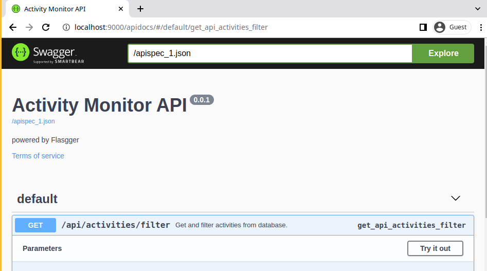

<h1 align="center">⌚ Activity Tracker</h1>

### Introduction

An open-source productivity app that logs desktop activity data.

> Records foreground window name and tracks idle times based on user input activity. 

Uses [desktopspy](https://github.com/elpachongco/desktopspy) under the hood.

### Features

- Open source
- Supports windows and linux
- Your data is yours only, forever
- Dashboard
- REST API

### Setup (Windows)

#### Usage Requirements

- Windows OS
- Python (tested on 3.7 & 3.9) 
- Poetry [installation instructions](https://python-poetry.org/docs/#installation)

To get the required project dependencies:
```bat
cd path\to\activity-monitor
poetry install
```
You can now run `main.py` using `poetry run python3 main.py`.

### Running the program on startups (Windows)

- Make a windows shortcut of the `startup.bat` (right
click the file -> send to -> desktop -> create shortcut).
- Then paste that shortcut (which will be on Desktop) to `%appdata%\Microsoft\Windows\Start Menu\Programs\Startup` (This can easily be accessed by pressing the `Windows Key + r` then entering
`shell:startup`). 
- A file explorer window will show up. Paste the shortcut. 
- The program will now run every startup.

### Setup (Linux)

### Usage Requirements

- Python (tested on 3.8) 
- Poetry [installation instructions](https://python-poetry.org/docs/#installation)

To get the required project dependencies:
```bash
cd path/to/activity-monitor
poetry install
```

You can now run `main.py` using `poetry run python3 main.py`

### Running the program on startups (Linux)

To run the programs at startup 

- Make `startup.sh` executable: `chmod +x startup.sh`

- Enter crontab -e in the terminal 
- Choose an editor. This example uses nano.
- Paste the following code:

        @reboot export DISPLAY="<insert output>" && cd /home/<user>/<project directory> && /<poetry location>/poetry run /bin/bash ./startup.sh >> /tmp/startup.log

- Run `echo $DISPLAY` in a terminal and put the result in the display variable `<insert output>`
- Example: `export DISPLAY=":0"`
- Replace `<user>` with the your username
- Replace `<project directory>` with location of the project.
- Then run `whereis poetry` in a terminal and put the result in the `<poetry location>` property.
- Example: `/home/anon/.poetry/bin/poetry` 

The final command should look like this (Note: one line only): 

        @reboot export DISPLAY=":0" && cd /home/anon/Programming/activity-monitor/ && /home/anon/.poetry/bin/poetry run /bin/bash ./startup.sh >> /tmp/startup.log

- Save using Ctrl + X then Y and Enter to save changes.

If done, you may now reboot. 

Check if running on startup with command: `cat /tmp/startup.log`. This should
return two lines containing the PID of the `main.py` and the flask server.

TODO: This can be automated with a script.

### Dashboard

A dashboard served by flask is available at `http://localhost:9000`

### HTTP API

Access the REST API documentation at `http://localhost:9000/apidocs`.


## File Structure 

```sh
.
│   .gitignore
│   activity.db # Generated SQL db
│   CHANGELOG.md
│   main.py # Main controller
│   Pipfile
│   Pipfile.lock
│   README.md
│   startup.bat
│
├───config
│       config.py
│       keywords.py
│
├───dashboard # Experimental dashboard
│
├───docs
│       doc.md
│
└───src # Files used by main.py 
        tracker.py
        uploader.py

```
## Bugs

- No mechanism against programs or webpages that change window names
- Linux implementation depends on xdotool. DISPLAY env variable must be set properly.

## Documentation

See `docs/` for additional documentation. 

## TODO 
- Local dashboard
- Code cleanup 
 - for reliability (this program might run 24/7)
 - Create a configuration file
 - Better portability for windows. Currently, the process name lookup involves
      using a command line tool which I am not sure exists on older platforms. 
- Documentation
- Tests
- ~~Port to Linux~~ Done!
